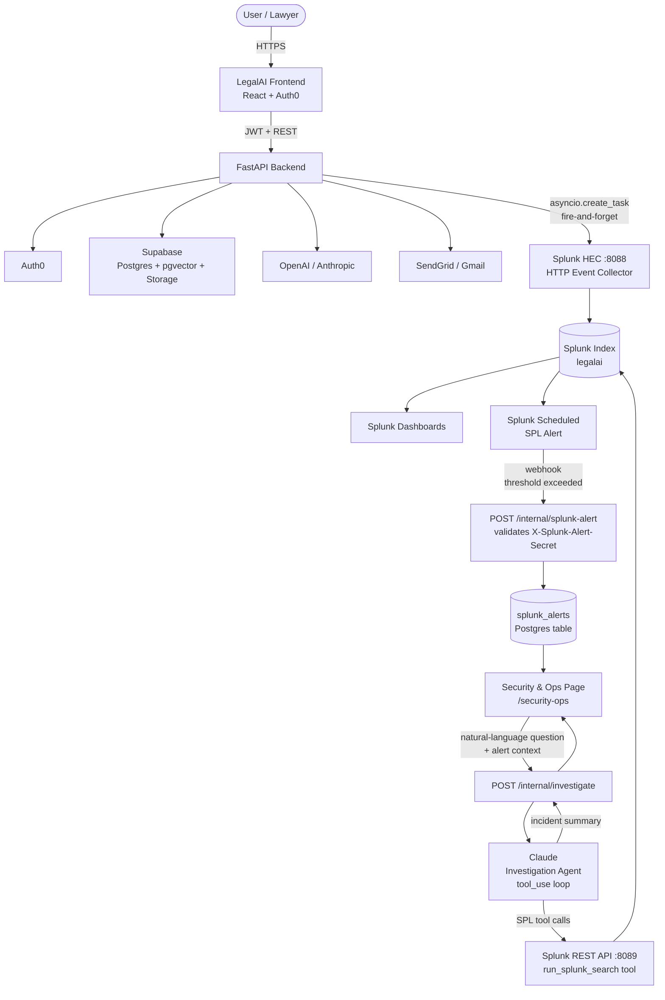

# Splunk Integration

## Goal

Integrate Splunk into LegalAI as a security and observability intelligence layer.

LegalAI handles sensitive legal documents, tenant-isolated workspaces, AI-generated answers, citations, Gmail sync, and email workflows. Splunk should help the product answer operational and security questions such as:

- Who accessed which client matter?
- Did a user query an unusual number of documents?
- Are API errors or latency increasing for a tenant?
- Are document ingestion jobs failing?
- Is Gmail sync silently breaking?
- Did AI usage or token cost spike unexpectedly?
- Are failed logins, permission denials, or suspicious access patterns increasing?

Splunk should not sit directly in the critical chat path. LegalAI should continue to work if Splunk is temporarily unavailable. Events should be emitted asynchronously or with safe retry behavior.

## Architecture



**Core application path:** `User → LegalAI → RAG / LLM → Response`

**Observability path:** `LegalAI → Splunk HEC (async) → Splunk Index → Dashboards`

**Security path:** `Splunk SPL Alert → Webhook → splunk_alerts table → Admin Console → Claude Investigation → Summary`

## Hackathon Positioning

The strongest framing is:

> LegalAI uses Splunk to provide AI governance, API observability, and security monitoring for law-firm AI workflows.

This can fit both the Observability and Security tracks:

- Observability: monitor API health, RAG latency, document ingestion, model reliability, streaming failures, and AI cost.
- Security: detect suspicious access to legal matters, abnormal AI usage, permission-denied spikes, failed logins, and possible data exfiltration behavior.

## What LegalAI Should Send To Splunk

LegalAI should emit structured JSON events. These events should contain operational metadata, not privileged legal content.

Avoid sending:

- Raw legal document text
- Full user prompts
- Full AI answers
- Email body content
- Unredacted file names if they may contain privileged matter details
- Secrets, API keys, OAuth tokens, or authorization headers

Prefer sending:

- Tenant IDs
- User IDs
- Matter IDs
- Conversation IDs
- Request IDs
- Event types
- Status codes
- Latency
- Model names
- Token counts
- Error categories
- Counts, scores, and safe metadata

## Event Categories

### API Events

```text
api.request
api.error
api.rate_limited
api.validation_failed
api.streaming_started
api.streaming_failed
```

Useful fields:

```json
{
  "event_type": "api.request",
  "request_id": "req_123",
  "firm_id": "firm_123",
  "user_id": "user_456",
  "method": "POST",
  "path": "/api/chat/stream",
  "status_code": 200,
  "latency_ms": 1240,
  "timestamp": "2026-05-18T10:00:00Z"
}
```

### Authentication And Authorization Events

#### LegalAI-Sourced (emit from FastAPI)

These are events LegalAI can observe directly — they fire when a JWT reaches the backend or when app-layer access control blocks a request.

```text
auth.token_validation_failed
auth.permission_denied
```

Useful fields:

```json
{
  "event_type": "auth.permission_denied",
  "firm_id": "firm_123",
  "user_id": "user_456",
  "resource_type": "client",
  "resource_id": "client_789",
  "action": "read",
  "reason": "missing_membership",
  "timestamp": "2026-05-18T10:00:00Z"
}
```

#### Auth0-Sourced via Log Streaming — #TODO

Auth0 owns the login/logout lifecycle. LegalAI never sees a failed login — the user never reaches the API. These events should be forwarded directly from Auth0 to Splunk using Auth0 Log Streaming (no LegalAI code required).

```text
# TODO: Configure Auth0 Log Streaming → Splunk HEC
# Auth0 log types to forward:
#   s   (Success Login)
#   f   (Failed Login)
#   slo (Success Logout)
#   limit_wc (Brute-force blocked)
```

Reference: https://auth0.com/docs/customize/log-streams

### Client And Document Events

```text
client.created
client.updated
client.deleted
document.uploaded
document.deleted
document.download_url_issued
document.ingestion_started
document.ingestion_completed
document.ingestion_failed
document.chunked
document.embedded
```

**`document.download_url_issued` implementation note:** Supabase Storage serves files via signed URLs — the FastAPI backend never observes the actual download. Add `GET /documents/{id}/download-url` to `app/routers/documents.py`: verify ownership, generate a short-lived Supabase signed URL, emit `document.download_url_issued` to Splunk, then return the URL. This is the audit boundary for download activity. The `security.data_export_spike` SPL alert should count `document.download_url_issued` events, not `document.uploaded`.

Useful fields for `document.download_url_issued`:

```json
{
  "event_type": "document.download_url_issued",
  "request_id": "req_abc",
  "firm_id": "firm_123",
  "user_id": "user_456",
  "client_id": "client_789",
  "document_id": "doc_123",
  "file_type": "pdf",
  "timestamp": "2026-05-18T10:00:00Z"
}
```

Useful fields:

```json
{
  "event_type": "document.ingestion_completed",
  "firm_id": "firm_123",
  "user_id": "user_456",
  "client_id": "client_789",
  "document_id": "doc_123",
  "file_type": "pdf",
  "page_count": 42,
  "chunk_count": 180,
  "latency_ms": 8200,
  "timestamp": "2026-05-18T10:00:00Z"
}
```

**`page_count` implementation note:** `_extract_text_pdf` in `ingestion_service.py` must be updated to return `(text, page_count)` — read `len(reader.pages)` from the `PdfReader` before extracting text. Pass `page_count` through to the Splunk event. Do not add it as a DB column. For DOCX, emit `"page_count": null` — python-docx does not expose a reliable page count.

### RAG And AI Events

```text
rag.query_started
rag.retrieval_completed
rag.answer_started
rag.answer_generated
rag.low_confidence
rag.no_citations
llm.request
llm.error
llm.timeout
llm.cost_recorded
```

Useful fields:

```json
{
  "event_type": "rag.answer_generated",
  "firm_id": "firm_123",
  "user_id": "user_456",
  "client_id": "client_789",
  "conversation_id": "conv_123",
  "model": "gpt-5.4",
  "retrieved_chunks": 8,
  "citation_count": 4,
  "input_tokens": 2400,
  "output_tokens": 620,
  "latency_ms": 3210,
  "timestamp": "2026-05-18T10:00:00Z"
}
```

**Token count implementation note:** `input_tokens` and `output_tokens` must come from the provider's usage response, not estimated from character counts. `llm_service.stream_response()` must be updated to yield a usage sentinel dict (e.g. `{"usage": {"input_tokens": N, "output_tokens": N}}`) as its final item after all text tokens. `chat.py` detects the sentinel, uses the counts in the Splunk event, and does not forward it to the SSE stream. For OpenAI streaming, enable this with `stream_options={"include_usage": True}`. For Anthropic streaming, read the `usage` field from the final `message_delta` event.

### Email And Gmail Events

```text
email.draft_created
email.sent
email.send_failed
gmail.connected
gmail.disconnected
gmail.sync_started
gmail.sync_completed
gmail.sync_failed
```

Useful fields:

```json
{
  "event_type": "gmail.sync_failed",
  "firm_id": "firm_123",
  "user_id": "user_456",
  "error_type": "oauth_refresh_failed",
  "retryable": true,
  "latency_ms": 1500,
  "timestamp": "2026-05-18T10:00:00Z"
}
```

### Security Events — Splunk-Detected, Webhook-Delivered

LegalAI does not compute security anomalies. Splunk runs scheduled SPL alerts over raw events and POSTs findings to LegalAI when thresholds are crossed.

**Flow:**
```text
LegalAI raw events → Splunk index
Splunk scheduled alert (SPL) → detects anomaly
Splunk alert action → POST /internal/splunk-alert → LegalAI stores + surfaces in admin console
```

**Alert types Splunk should be configured to detect:**

All thresholds are provisional — mark SPL alerts `[TUNE AFTER BASELINE]` until real usage data establishes normal per-firm patterns.

| Alert | SPL condition | Window | Provisional threshold |
|---|---|---|---|
| `security.suspicious_access` | distinct `client_id` count AND `auth.permission_denied` count per `user_id` | 60 min rolling | > 5 distinct clients AND > 3 permission denials |
| `security.unusual_ai_usage` | `rag.query_started` count vs. user's 7-day rolling average per `user_id` | 30 min rolling | > 3× 7-day average, minimum 15 queries (suppresses new-user noise) |
| `security.excessive_client_access` | distinct `client_id` count per `user_id` | 60 min rolling | > 10 distinct clients |
| `security.repeated_permission_denied` | `auth.permission_denied` count per `user_id` | 15 min rolling | > 5 denials |
| `security.data_export_spike` | `document.download_url_issued` count per `user_id` | 30 min rolling | > 20 URLs issued OR > 3× user's 7-day rolling average |
| `security.admin_change` | — | — | **#TODO** — requires `role`/`is_admin` on `users` table |

**Webhook payload LegalAI expects at `POST /internal/splunk-alert`:**

```json
{
  "alert_name": "security.unusual_ai_usage",
  "firm_id": "firm_123",
  "user_id": "user_456",
  "window_minutes": 30,
  "rag_query_count": 47,
  "baseline_query_count": 9,
  "risk_score": 0.86,
  "splunk_search_id": "scheduler__admin__search_123",
  "timestamp": "2026-05-18T10:00:00Z"
}
```

**Endpoint security:** The `/internal/splunk-alert` endpoint must:
- Validate `X-Splunk-Alert-Secret` header against `settings.splunk_alert_secret` using `secrets.compare_digest` (timing-safe).
- Only be registered when `settings.splunk_enabled` is `True`.
- Live in a new `app/routers/internal.py` router, not mixed into user-facing routers.

**Persistence:** Incoming alerts are written to a `splunk_alerts` DB table. The admin console queries this table directly — no live Splunk query needed for the alert feed.

```sql
splunk_alerts
─────────────────────────────────────────────
id               UUID  PRIMARY KEY
firm_id          UUID  NOT NULL  FK → firms.id
user_id          UUID  NULLABLE  (subject of the alert, not the requester)
alert_name       TEXT  NOT NULL
payload          JSONB NOT NULL  (full webhook body, verbatim)
splunk_search_id TEXT  NULLABLE
risk_score       FLOAT NULLABLE
received_at      TIMESTAMPTZ NOT NULL DEFAULT now()
acknowledged     BOOL NOT NULL DEFAULT false
```

`payload` stores the full webhook body as JSONB so new alert fields from Splunk don't require a migration. `acknowledged` lets firm admins dismiss alerts from the console.

## Splunk Use Cases

### API Observability

Use Splunk to monitor:

- Error rate by endpoint
- Latency by endpoint
- Streaming response failures
- Failed document uploads
- Document ingestion duration
- LLM provider timeout rate
- RAG retrieval latency
- Token usage by firm
- Cost anomalies by firm or model

Example investigation:

> Why are lawyers seeing slow answers today?

Splunk can correlate:

- Increased `/api/chat/stream` latency
- Longer vector retrieval times
- LLM provider timeouts
- Larger-than-normal document context windows

### Security Monitoring

Use Splunk to detect:

- Repeated failed logins
- Permission-denied spikes
- Users accessing many unrelated clients
- Abnormal document upload/download behavior
- Sudden AI usage spikes
- Suspicious Gmail sync failures
- Admin role changes
- Possible prompt-abuse or exfiltration patterns

Example investigation:

> Did user `user_456` access an unusual number of clients today?

Splunk can reconstruct:

- Client access timeline
- RAG query count
- Permission denials
- Document access volume
- Admin changes
- Related API errors

### AI Governance

Use Splunk to observe and audit AI behavior:

- Which models are used most often?
- Which tenants generate the highest token costs?
- Which conversations produce low-citation answers?
- Which document types fail ingestion?
- Which users trigger the most low-confidence answers?
- Which model has the highest timeout/error rate?

## Splunk AI Capabilities To Consider

### Splunk MCP Server

Use Splunk MCP Server to let an AI agent securely query Splunk data.

LegalAI could offer an admin investigation assistant:

> "Why did this tenant's AI usage spike today?"

The agent could query Splunk, summarize findings, and recommend actions.

This is a strong hackathon option because the Devpost prize list includes "Best Use of Splunk MCP Server."

### Splunk AI Assistant

Use Splunk AI Assistant to help generate or edit SPL queries from natural language.

Possible LegalAI admin experience:

> "Show failed document ingestion events grouped by tenant in the last 24 hours."

The assistant generates SPL, Splunk runs the search, and LegalAI displays the result.

### Splunk AI Toolkit

Use Splunk AI Toolkit to build custom models over LegalAI operational data.

Possible models:

- Suspicious matter-access detector
- AI cost anomaly detector
- Document ingestion failure predictor
- RAG latency anomaly detector
- User behavior risk scoring

### Splunk Hosted Models

Use Splunk Hosted Models for security or time-series analysis.

Possible uses:

- Forecast API traffic
- Detect unusual latency patterns
- Classify security event summaries
- Analyze time-series usage spikes

## LegalAI Admin Console Ideas

Add a "Security & Ops" page for tenant admins or platform operators.

Possible widgets:

- API health summary
- Current incident count
- Recent failed logins
- Permission-denied timeline
- Document ingestion failures
- RAG latency chart
- AI token spend by model
- Suspicious access alerts
- Gmail sync health
- Splunk AI-generated incident summaries

Example incident summary:

```text
Incident: Unusual AI and client access activity

Firm: firm_123
User: user_456
Risk score: 0.86

Evidence:
- 47 RAG queries in 30 minutes
- 12 clients accessed
- 6 permission-denied events
- AI usage 4.8x higher than tenant baseline

Recommended actions:
- Require re-authentication
- Notify firm admin
- Review matter access history
- Temporarily disable suspicious session
```

## MVP Implementation Plan

1. Add `request_id` middleware to `main.py` — generates a `uuid4` per request, stores it in `request.state.request_id`, and echoes it as `X-Request-ID` on every response.
2. Add environment variables for Splunk configuration to `config.py` (see Suggested Environment Variables).
3. Add a `splunk_alerts` table via Alembic migration.
4. Add `app/routers/internal.py` with `POST /internal/splunk-alert` — validates `X-Splunk-Alert-Secret`, persists payload to `splunk_alerts`.
5. Add a backend Splunk event emitter service (`app/services/splunk_service.py`).
6. Update `llm_service.stream_response()` to yield a usage sentinel with real `input_tokens`/`output_tokens` from the provider.
7. Add `GET /documents/{id}/download-url` to `app/routers/documents.py` — generates Supabase signed URL and emits `document.download_url_issued`.
8. Emit structured events from API, auth, document ingestion, RAG, email, and Gmail workflows.
9. Create sample Splunk dashboards or saved searches.
10. Add a LegalAI admin "Security & Ops" page — reads from `splunk_alerts` table and Splunk dashboards.
11. Add Splunk MCP Server or Splunk AI Assistant integration for natural-language investigation.
12. Document setup and include the architecture diagram in the repository.

## Suggested Environment Variables

```text
# Event emission (HEC — write-only)
SPLUNK_ENABLED=false
SPLUNK_HEC_URL=https://your-splunk-host:8088/services/collector
SPLUNK_HEC_TOKEN=your-hec-token
SPLUNK_INDEX=legalai
SPLUNK_SOURCE=legalai-backend
SPLUNK_SOURCETYPE=legalai:json
SPLUNK_TIMEOUT_SECONDS=3

# Inbound alert webhook security
SPLUNK_ALERT_SECRET=your-shared-secret   # generate: openssl rand -hex 32

# Investigation assistant (REST API — separate from HEC)
SPLUNK_API_URL=https://your-splunk-host:8089
SPLUNK_API_TOKEN=your-splunk-api-bearer-token
```

- `SPLUNK_HEC_TOKEN` — write-only token for the HTTP Event Collector. Create under **Settings → Data Inputs → HTTP Event Collector**.
- `SPLUNK_ALERT_SECRET` — shared secret for the inbound webhook. Validated via `secrets.compare_digest` on `X-Splunk-Alert-Secret`. Set the same value in LegalAI and in each Splunk alert's webhook action header.
- `SPLUNK_API_TOKEN` — REST API bearer token for the investigation assistant's SPL queries. Create under **Settings → Tokens** (Splunk 8.x+) or use a service account password. This is **separate** from the HEC token — the REST API uses different auth.

## Setup Guide

### 1. Provision Splunk

Use **Splunk Cloud** (free trial at splunk.com/en_us/download/splunk-cloud.html) or **Splunk Enterprise** (free developer licence, 500 MB/day ingest).

### 2. Create the Splunk index

Settings → Indexes → New Index

| Field | Value |
|---|---|
| Index name | `legalai` |
| Index Data Type | Events |
| Max size | your preference |

### 3. Create the HEC token

Settings → Data Inputs → HTTP Event Collector → New Token

| Field | Value |
|---|---|
| Name | `legalai-backend` |
| Source type | `legalai:json` (create manually if not listed) |
| Allowed indexes | `legalai` |

Copy the token value → set as `SPLUNK_HEC_TOKEN`.

Set `SPLUNK_HEC_URL` to `https://<your-host>:8088/services/collector`.

Splunk Cloud: use your `<stack>.splunkcloud.com` hostname.  
Splunk Enterprise: use your server's IP/hostname.

### 4. Create the REST API token (investigation assistant)

Settings → Tokens → New Token

| Field | Value |
|---|---|
| User | your admin account |
| Expiry | your preference |

Copy the token value → set as `SPLUNK_API_TOKEN`.  
Set `SPLUNK_API_URL` to `https://<your-host>:8089`.

### 5. Set LegalAI environment variables

Add all variables from **Suggested Environment Variables** above to your Railway (or local `.env`) deployment. Set `SPLUNK_ENABLED=true` last, after all other vars are confirmed.

### 6. Run Alembic migration

```bash
cd backend
alembic upgrade head
```

This creates the `splunk_alerts` table (migration `003_splunk_alerts.py`).

### 7. Import the Splunk dashboard

1. Open Splunk Web → Dashboards → Create New Dashboard → **Source**
2. Paste the contents of `docs/splunk/dashboard.xml`
3. Save and confirm panels load (they will be empty until events flow in)

### 8. Configure scheduled SPL alerts

For each alert in `docs/splunk/alerts.md`:

1. Splunk Web → Search → paste the SPL query → **Save As → Alert**
2. Set the schedule (see each alert's `Schedule` field)
3. Set **Trigger condition**: Number of results > 0
4. Add action: **Webhook**
   - URL: `https://<your-legalai-host>/internal/splunk-alert`
   - Add custom header: `X-Splunk-Alert-Secret: <value of SPLUNK_ALERT_SECRET>`

### 9. Verify end-to-end

```bash
# Send a test HEC event manually
curl -k https://<your-host>:8088/services/collector \
  -H "Authorization: Splunk <SPLUNK_HEC_TOKEN>" \
  -H "Content-Type: application/json" \
  -d '{"index":"legalai","sourcetype":"legalai:json","event":{"event_type":"api.request","firm_id":"test","status_code":200}}'
```

Then run `index=legalai` in Splunk Search — the test event should appear within seconds.

### 10. Access the admin console

Navigate to `https://<your-legalai-host>/security-ops` (Auth0 login required). The page reads from the `splunk_alerts` table and exposes the AI investigation assistant.

## Implementation Notes

- Emit events via `asyncio.create_task` — fire an async HTTP POST to Splunk HEC, wrapped in `try/except` so any Splunk failure is silently swallowed and never raises to the caller. No new infrastructure required for MVP.
- Do not block user-facing API responses on Splunk ingestion.
- Upgrade path: replace `asyncio.create_task` with **ARQ** (async-native Redis queue) when durable, retryable delivery is needed. ARQ fits the existing `asyncio` stack without introducing Celery or a separate worker runtime.
- Redact or hash sensitive values before sending events.
- Use stable event names.
- Include `firm_id`, `user_id`, `request_id`, and `timestamp` on every event. `request_id` is generated by middleware in `main.py`, stored in `request.state.request_id`, and returned to clients as `X-Request-ID`. Background tasks (e.g. document ingestion) carry the `request_id` from the originating HTTP request as a parameter.
- Keep event schemas versioned if they become part of product behavior.
- Treat Splunk failures as observability failures, not product failures.

## Demo Story

The demo should show a realistic LegalAI incident:

1. A user uploads documents and asks many AI questions across several clients.
2. LegalAI emits API, RAG, document, and security events to Splunk.
3. Splunk detects unusual AI usage and client access, fires a webhook to `POST /internal/splunk-alert`.
4. The LegalAI admin console shows an incident summary read from the `splunk_alerts` table.
5. An AI investigation assistant uses Splunk data to explain what happened.
6. The admin sees recommended actions.

Demo prompt:

> Why did firm `firm_123` have an AI usage spike today, and was it suspicious?

Expected answer:

> Firm `firm_123` had 47 RAG queries in 30 minutes from `user_456`, 4.8x above baseline. The same user accessed 12 clients and triggered 6 permission-denied events. This should be reviewed as suspicious access behavior.

## Success Criteria

The integration is successful if LegalAI can:

- Emit structured events to Splunk for all covered event categories.
- Show API observability using Splunk data.
- Show security monitoring using Splunk data.
- Receive a Splunk alert webhook, persist it to `splunk_alerts`, and surface it in the admin console.
- Explain at least one AI or security incident end-to-end (raw events → Splunk detection → webhook → admin console).
- Avoid sending privileged legal content to Splunk.
- Continue functioning when Splunk is unavailable.
- Present a clear architecture diagram for the hackathon submission.
